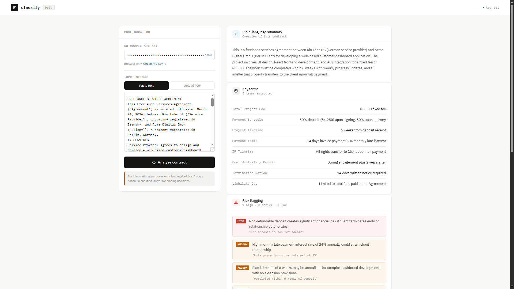

# Clausify — AI Contract Reviewer

An AI-powered contract analysis tool that reviews legal documents and surfaces risks, key terms, party obligations, and missing clauses — in seconds. Paste contract text directly or upload a PDF.

**Live demo → [rinlabsx.github.io/clausify](https://rinlabsx.github.io/clausify)**

---

## What it does

- Accepts contract text via paste or PDF upload (drag-and-drop supported)
- Extracts 5–8 key terms: amounts, dates, durations, penalties, IP ownership
- Flags risks by severity: high, medium, and low — with clause references
- Breaks down party obligations clearly between both sides of the agreement
- Identifies missing clauses typically expected in that contract type
- Renders all five analysis sections as structured, readable output cards

## Tech stack

- Vanilla HTML, CSS, JavaScript — no framework, no dependencies
- [Claude API](https://www.anthropic.com/) (`claude-sonnet-4-20250514`) for contract analysis
- [PDF.js](https://mozilla.github.io/pdf.js/) for client-side PDF text extraction
- Single-file architecture, opens directly in any modern browser
- Fully responsive

## Running it locally

No installation needed. Open `index.html` in any modern browser.

You'll need an Anthropic API key — get one at [console.anthropic.com](https://console.anthropic.com/settings/keys). Your key stays in the browser and is sent exclusively to Anthropic's API. This tool does not store or transmit your documents anywhere else.

## Disclaimer

For informational purposes only. Not legal advice. Always consult a qualified lawyer for binding decisions.

## Why this exists

This is a portfolio piece demonstrating AI-augmented full-stack development — specifically how Claude can be integrated as a genuine analytical layer to solve a concrete business problem. Contract review is time-consuming and expensive; this tool makes a first pass accessible to anyone.

Built by [Nova R.](https://www.upwork.com/freelancers/~0176f7c51b68d07c0e) — AI-Augmented Full-Stack Developer based in Germany.

---

## License

MIT
